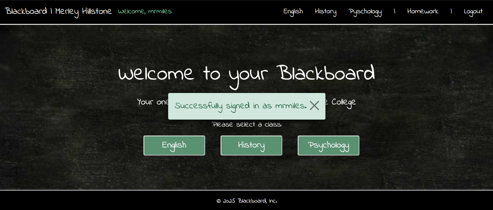
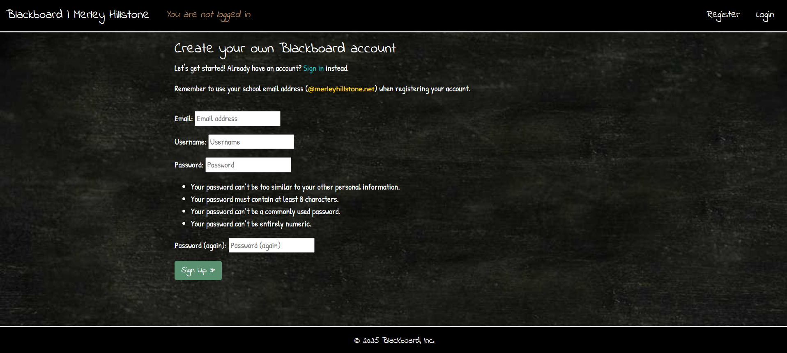

# Blackboard: An E-Learning Platform

Blackboard is an e-learning platform for use by teachers and students, namely targeted at high schools and colleges. Teachers can post lessons on the site, Users can engage in open discussions via comment threads, and students can submit homework directly to their teachers. For the purpose of demonstration, this project shows what a 'Blackboard' would look like for the fictional institution of 'Merley Hillstone College'.

[Visit the deployed site here](https://pp4-blackboard-784826d2762e.herokuapp.com/).

*(Note: you'll have to create an account to view the site's content. To emulate institution-specific authentication, I've restricted account registrations to only those with an email address ending in @merleyhillstone.net. There is no actual email authentication process for this demo.)* 

If you have a superuser or staff account, you can [access the admin panel here](https://pp4-blackboard-784826d2762e.herokuapp.com/admin/).

## Table of Contents

### [User Experience (UX)](#user-experience-ux-1)
* [User Stories](#user-stories)
### [Design](#design-1)
* [Logic Design](#logic-design)
* [Visual Design](#visual-design)
### [Features](#features-1)
#### [Front End](#front-end)
* [Homepage](#homepage)
* [Lesson Feed](#lesson-feed)
* [Lesson Detail](#lesson-detail)
* [Comments](#comments)
* [Homework](#homework)
* [Authentication](#authentication)
#### [Admin Panel](#admin-panel)
* [Subjects](#subjects)
* [Lessons](#lessons)
* [Comment Management](#comment-management)
* [Homework Submissions](#homework-submissions)
* [User Management](#user-management)
### [Future Features](#future-features-1)
* [Bespoke Profiles](#bespoke-profiles)
* [Front End UI for Teachers](#front-end-ui-for-teachers)
* [Homework CRUD Functionality](#homework-crud-functionality)
* [More Content](#more-content)
### [Technologies Used](#technologies-used-1)
* [Languages](#languages)
### [Frameworks, Libraries & Programs Used](#frameworks-libraries--programs-used-1)
### [Testing](#testing-1)
* [Validators](#validators)
* [Manual Testing & Bug Fixes](#manual-testing--bug-fixes)
### [Local Development & Deployment](#local-development--deployment-1)
* [Forking the GitHub Repository](#forking-the-github-repository)
* [Local Clone](#local-clone)
### [Credits](#credits)
* [Affiliations](#affiliations)
* [Copy (Written Material)](#copy-written-material)
* [Online Resources](#online-resources)

### User Experience (UX)
Blackboard provides two distinct User experiences: the Student Experience and the Teacher Experience.

#### Student Experience
The Student Experience is entirely front-end focused. Once signed in, students can naviagte the app to access different subjects, each with their own set of lessons created and published by the teachers. Upon selecting a subject, the student is presented with an 'infinite scroll' list of relevant lessons, and from there they can select which lesson they want to enter.

Each lesson has it's own comment thread, allowing students and teachers to discuss the lesson's content in an open forum. Comments can be edited and/or deleted by the commenter, or reported by other students who may take offence to the comment. Reported comments are hidden from view pending review of a teacher, who can either approve or delete the comment as they see fit.

As well as navigating and commenting on lessons, students can submit homework directly to their teachers via the 'homework' section of the site.

The student experience is focused simple but rewarding interaction with front-end features, offering a contemporary way for students to engage with academic material.

#### Teacher Experience
Teacher's accounts are designated as 'Staff' by a superuser, and granted certain Admin permissions to allow them to interact directly with the site's database.

Using Django's built in, user-friendly Admin panel, teachers are given full CRUD (Create, Read, Update and Delete) functionality over lessons, User comments and homework submissions. This allows teachers to directly manage the content of their respective subjects, as well as monitor and manage User comments and review student homework submissions. Handling these features via the Django Admin panel allows teachers a greater degree of control whilst also hiding the 'behind the scenes' work from their students. 

The teacher experience is focused on an intuitive Admin panel allowing for quick and easy access to the site's database, without compromising on the level of control afforded to them.

#### User Stories

When originally designing Blackboard, I created a Project in GitHub containing a list of User Stories that set out my intended features. These User Stories can be viewed [here](https://github.com/users/MattMiles95/projects/7).

### Design

#### Logic Design

The Entity Relationship Diagram (ERD) below represents the project database and the relationship between its models.

#### Visual Design

##### Wireframes

Below are the wireframes I used to create the initial layout and design for the project, including it's homepage, a 'lesson feed' and a detailed view of a lesson. 

 Wireframe - Homepage 

 Wireframe - Lesson Feed 

 Wireframe - Lesson Detail 

##### Theme

 Screenshot - Homepage 

 Screenshot - Lesson Feed 

 
Due to being targeted at educational institutions, I've designed the site to look like its namesake. I've used an image of a plain blackboard for each page's background (sometimes with writing added in photoshop) and selected fonts that match this aesthetic.

##### Colours

As the nature of a 'blackboard theme' lends itself to a predominantly greyscale colour scheme, I've used pops of colour to draw the User's focus to important features, such as buttons, links and deadlines. Along with the images uploaded by teachers for their lessons, these pops of colour add enough vibrancy to make the site visually engaging, whilst still maintaining the blackboard theme.

I have also used colour semantically throughout the site to communicate to the User certain features. For example, the colour blue (#208fd9) is used for anything pertaining to homework (deadline flashes, buttons in the homework dashboard and the submit button on the homework submission page). This was primarily done to offer a simple visual distinction between the homepage and the homework dashboard, which have the same layout but for slightly different text, and the homepage buttons being green (#5a9171). This design extends into the buttons and alert messages that appear as well; for example, the 'delete comment' button being red (danger).

##### Typography

As mentioned above, I chose fonts that were inkeeping with the aesthetic of the blackboard theme; fonts that emulate a 'handwritten' style. The main font used is the Google Font, 'Indie Flower', as this most closely resembled the handwritten style I wanted. I have also used the Google Font, 'Patrick Hand', in places I wanted a slightly more legible font, as this font uses a less exagerated handwritten style. Lastly, for even larger chunks of text where I wanted the font to be even clearer (such as the lessons themselves), I've used the Google Font, 'Lexend'. This is a neutral sans-serif font that ensures none of the lesson content is lost in the aesthetic of the site.

##### Accessibility
To ensure every User has equal opportunity to enjoy the site, I ensured maximum accessibility in its design and code:
 
* Alt text and aria-labels are used throughout the site to aid screen readers.

* All colour schemes utilise contrast between background and foreground to ensure ease of readability.

##### Responsiveness

Due to this site being intended for use in educational environments, it is designed primarily for workstations (computers / laptops). However, using Bootstrap and CSS media queries, I have also designed the site to be fully responsive across small screen devices, such as tablets and phones.

### Features

#### Front End

 Homepage 

Once signed in, the User has access to their classes from the homepage. They simply click the button of the subject they want to view, and they are taken to the corresponding lesson feed.

 

 Lesson Feed 

The Lesson Feed is where all published lessons for the selected subject are displayed for the User. To the left of the feed, the background image is altered to reflect the subject and teacher. Each lesson post has an image (a subject-specific placeholder image is used if the teacher does not upload one themselves), the homework deadline, a title and a lesson summary. Below each lesson is the details of which teacher posted the lesson and when. The Lesson Feed uses an 'infinite scrolling' design to provide a seamless UX. To view a lesson in detail, the User just needs to click on the title or summary of the post, which appear to glow when under the cursor to indicate interactivity. 

If no lessons have been added to the subject yet, a placeholder post will appear in the Feed, informing the User that the teacher hasn't yet posted a lesson.

 

 Lesson Detail 

Once a lesson has been selected, the User is taken to a page providing the full content for that lesson. At the bottom of this page is a comment section, where users can discuss the lesson in a forum setting.

 

 Comments 

The comment section is comprised of 3 parts: (1) the Comment Counter, (2) the Comment Thread, and (3) the Comment Form. The Comment Counter is automatically updated each time a User comments on the lesson. It displays the total number of comments posted on each lesson. The Comment Thread is where all posted comments are displayed, along with details of who posted the comment and when. Lastly, the Comment Form is simply a textbox where the User can write out their comment and click, 'submit'.

User comments have full CRUD functionality, meaning Users can also edit and/or delete their previously posted comments. This can be done by simply clicking the corresponding buttons visible to the User underneath their comments. If the User selects to delete their comment, a confirmation modal will pop up to confirm their action. This is an important UX feature to reduce the likelihood of a comment being delete by accident. 

Comments posted by other Users will have a 'report' button beneath them. This allows users to report offensive comments, which will then be reviewed by a teacher. A reported comment disappears from sight for all users except the author of said comment, who instead will see their comment faded, with a message informing them that their comment has been reported. As with the delete button, the report button triggers a confirmation modal.

 

 Homework 

Within the 'Homework' section of the site, users can submit homework directly to their teachers. Upon selecting 'Homework' from the navbar, the User is taken to the Homework Dashboard. Here they can select which subject they wish to submit homework for. Once a subject has been selected, the User is taken to the homework submission form. The dropdown menu at the top of this form allows the User to select the lesson they are submitting homework for. This dropdown menu will be filtered to only display lessons related to the chosen subject. 

Beneath the main content section of the form is a second, smaller textbox. This textbox is optional to fill out, and allows the User to submit any additional comments to the teacher alongside their work.

Similarly to deleting and reporting comments, a confirmation modal appears when a User submits their homework. This is simply to prevent accidental homework submissions. If the User tries to submit the form without selecting a lesson or entering text in the main content section, they will receive an alert message requesting they fill out the required fields. 

 

 Django Messages 

To deliver a satisfying UX, I have used Django messages throughout the site to provide feedback to the User. These are triggered by certain functions, such as signing in/out, commenting, editing or deleting a comment, or submitting homework. If these functions perform accordingly, a green message appears informing the User of the success. If the function fails, a red message appears informing the User that an error has occured.

 

 Authentication 

As this site is directed at educational institutions, security is very important - particularly ensuring that no unauthorised persons gain access to the site. For this reason, I have used Django's built-in authorisation models to verify that the User has logged in before being able to access any of the site's content. Should an unauthenticated User try to gain access to the site via a URL path, they will be automatically redirected to the account registration page.

Although this project doesn't utilise email verificaion for setting up new accounts, this would be a feature of the real product, as this would ensure that only those with a valid email account for the client institution can create an account. To emulate this feature, I have added a restriction to the account registration form to only accept email addresses ending in '@merleyhillstone.net'.

 

#### Admin Panel

 Staff vs Superuser 

Admin Panel from a teacher perspective.

Admin Panel from a superuser perspective.

To allow teachers control over their classes, they require more extensive access to the database. I have decided to use Django's built-in Admin Panel to enable this access, as it is user friendly whilst still offeirng robust control over the database. 

Using my superuser account, I created three teacher accounts and designated them as 'staff'. I then limited their permissions to only those that were required to perform their roles, to improve the UX for teachers by creating a less cluttered Admin Panel. This was also done to limit the number of accounts that have full CRUD functionality over the entire database; teachers cannot delete or change other Users and can only view / edit / delete their own lessons. 

Limiting full CRUD functionality over the entire database to just superuser accounts is important for the security of the database. In practice, the client institution using the site could decide the extent of permissions granted to their teachers, and how many / which teachers are granted superuser rights.

 

 Subjects 

From the 'Subjects' admin panel, staff can view what subjects exist and who is the assigned teacher for them. Superusers can create, delete and edit subjects here. Presently, the teacher field is restricted to only accounts that are staff, but are not superusers. This could be easily amended in practice, where it is likely that certain teachers would be the superusers.

 

 Lessons 

From the 'Subjects' admin panel, staff can view the lessons they've created.

 

Comment Management

Homework Submissions

User Management
