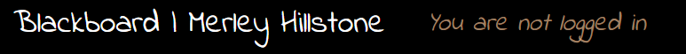

# Blackboard: An E-Learning Platform


Blackboard is an e-learning platform for use by teachers and students, namely targeted at high schools and colleges. Teachers can post lessons on the site, Users can engage in open discussions via comment threads, and students can submit homework directly to their teachers. For the purpose of demonstration, this project shows what a 'Blackboard' would look like for the fictional institution of 'Merley Hillstone College'.

[Visit the deployed site here](https://pp4-blackboard-784826d2762e.herokuapp.com/).

*(Note: you'll have to create an account to view the site's content. To emulate institution-specific authentication, I've restricted account registrations to only those with an email address ending in @merleyhillstone.net. There is no actual email authentication process for this demo.)* 

If you have a superuser or staff account, you can [access the admin panel here](https://pp4-blackboard-784826d2762e.herokuapp.com/admin/).

## Table of Contents

### [User Experience (UX)](#user-experience-ux-1)
* [User Stories](#user-stories)
### [Logic](#logic-1)
* [Entity Relationship Diagram (ERD)](#entity-relationship-diagram-erd)
### [Design](#design-1)
* [Wireframes](#wireframes)
* [Theme](#theme)
* [Colours](#colours)
* [Typography](#typography)
* [Accessibility](#accessibility)
* [Responsiveness](#responsiveness)
### [Features](#features-1)
* [Front End](#front-end)
* [Admin Panel](#admin-panel)
### [Future Features](#future-features-1)
* [Bespoke Profiles](#bespoke-profiles)
* [Front End UI for Teachers](#front-end-ui-for-teachers)
* [Homework CRUD Functionality](#homework-crud-functionality)
* [More Content](#more-content)
* [Refactoring](#refactoring)
### [Project Management - an Agile Approach](#project-management---an-agile-approach-1)
* [Agile Methodology](#agile-methodology)
* [MoSCoW Prioritisation](#moscow-prioritisation)
* [GitHub Project - Kanban Board](#github-project---kanban-board)
### [Technologies Used](#technologies-used-1)
* [Languages](#languages)
* [Frameworks, Libraries & Programs Used](#frameworks-libraries--programs-used-1)
### [Testing](#testing-1)
### [Local Development & Deployment](#local-development--deployment-1)
* [Forking the GitHub Repository](#forking-the-github-repository)
* [Local Clone](#local-clone)
* [Code Institute PostgreSQL Database](#code-institute-postgresql-database)
* [Cloudinary](#cloudinary)
### [Credits](#credits-1)
* [Affiliations](#affiliations)
* [Copy (Written Material)](#copy-written-material)
* [Code Credits](#code-credits)

## User Experience (UX)

Blackboard provides two distinct User experiences: the Student Experience and the Teacher Experience.

### Student Experience

The Student Experience is entirely front end focused. Once signed in, students can naviagte the app to access different subjects, each with their own set of lessons created and published by the teachers. Upon selecting a subject, the student is presented with an 'infinite scroll' list of relevant lessons, and from there they can select which lesson they want to enter.

Each lesson has it's own comment thread, allowing students and teachers to discuss the lesson's content in an open forum. Comments can be edited and/or deleted by the commenter, or reported by other students who may take offence to the comment. Reported comments are hidden from view pending review of a teacher, who can either approve or delete the comment as they see fit.

As well as navigating and commenting on lessons, students can submit homework directly to their teachers via the 'homework' section of the site.

The student experience is focused simple but rewarding interaction with front end features, offering a contemporary way for students to engage with academic material.

### Teacher Experience

Teacher's accounts are designated as 'Staff' by a superuser, and granted certain Admin permissions to allow them to interact directly with the site's database.

Using Django's built in, user-friendly Admin panel, teachers are given full CRUD (Create, Read, Update and Delete) functionality over lessons, User comments and homework submissions (minus the ability to delete homework). This allows teachers to directly manage the content of their respective subjects, as well as monitor and manage User comments and review student homework submissions. Handling these features via the Django Admin panel allows teachers a greater degree of control whilst also hiding the 'behind the scenes' work from their students. 

The teacher experience is focused on an intuitive Admin panel allowing for quick and easy access to the site's database, without compromising on the level of control afforded to them.

### User Stories

When originally designing Blackboard, I created a Project in GitHub containing a list of User Stories that set out my intended features. These User Stories can be viewed [here](https://github.com/users/MattMiles95/projects/7).

## Logic

### Entity Relationship Diagram (ERD)

The ERD below represents the project database and the relationship between its models.


## Design

### Wireframes

Below are the wireframes I used to create the initial layout and design for the project, including it's homepage, a 'lesson feed' and a detailed view of a lesson. 

<details>
<summary> Wireframe - Homepage </summary>


</details>

<details>
<summary> Wireframe - Lesson Feed </summary>


</details>

<details>
<summary> Wireframe - Lesson Detail </summary>


</details>

### Theme

<details>
<summary> Screenshot - Homepage </summary>


</details>

<details>
<summary> Screenshot - Lesson Feed </summary>


</details>

<br>
Due to being targeted at educational institutions, I've designed the site to look like its namesake. I've used an image of a plain blackboard for each page's background (sometimes with writing added in photoshop) and selected fonts that match this aesthetic.

### Colours

<details>
<summary> Colour Palette </summary>


</details>

<details>
<summary> Examples of colour use </summary>

<br>
Subject Buttons:


<br>
Welcome Message:


<br>
Signed-Out Message:



<br>
Deadline Flash:


<br>
Homework Dashboard:


<br>
Homework Submission Button:


<br>
Comment Buttons:


<br>
Report Button:


<br>
Registration:


</details>
<br>

As the nature of a 'blackboard theme' lends itself to a predominantly greyscale colour scheme, I've used pops of colour to draw the User's focus to important features, such as buttons, links and deadlines. Along with the images uploaded by teachers for their lessons, these pops of colour add enough vibrancy to make the site visually engaging, whilst still maintaining the blackboard theme.

I have also used colour semantically throughout the site to communicate to the User certain features. For example, the colour <span style="color:#208fd9">blue (#208fd9)</span> is used for anything pertaining to homework (deadline flashes, buttons in the homework dashboard and the submit button on the homework submission page). This was primarily done to offer a simple visual distinction between the homepage and the homework dashboard, which have the same layout but for slightly different text, and the homepage buttons being <span style="color:#5a9171">green (#5a9171)</span>. This design extends into the buttons and alert messages that appear as well; for example, the 'delete comment' button being <span style="color:#ba2626">red (danger).

### Typography

As mentioned above, I chose fonts that were inkeeping with the aesthetic of the blackboard theme; fonts that emulate a 'handwritten' style. The main font used is the Google Font, 'Indie Flower', as this most closely resembled the handwritten style I wanted. I have also used the Google Font, 'Patrick Hand', in places I wanted a slightly more legible font, as this font uses a less exagerated handwritten style. Lastly, for even larger chunks of text where I wanted the font to be even clearer (such as the lessons themselves), I've used the Google Font, 'Lexend'. This is a neutral sans-serif font that ensures none of the lesson content is lost in the aesthetic of the site.

### Accessibility

To ensure every User has equal opportunity to enjoy the site, I ensured maximum accessibility in its design and code:
 
* Alt text and aria-labels are used throughout the site to aid screen readers.

* All colour schemes utilise contrast between background and foreground to ensure ease of readability.

### Responsiveness

Due to this site being intended for use in educational environments, it is designed primarily for workstations (computers / laptops). However, using Bootstrap and CSS media queries, I have also designed the site to be fully responsive across small screen devices, such as tablets and phones.

## Features

### Front End

<details>
<summary> Homepage </summary>


Once signed in, the User has access to their classes from the homepage. They simply click the button of the subject they want to view, and they are taken to the corresponding lesson feed.
</details>
<br>

<details>
<summary> Lesson Feed </summary>


The Lesson Feed is where all published lessons for the selected subject are displayed for the User. To the left of the feed, the background image is altered to reflect the subject and teacher. Each lesson post has an image (a subject-specific placeholder image is used if the teacher does not upload one themselves), the homework deadline, a title and a lesson summary. Below each lesson is the details of which teacher posted the lesson and when. The Lesson Feed uses an 'infinite scrolling' design to provide a seamless UX. To view a lesson in detail, the User just needs to click on the title or summary of the post, which appear to glow when under the cursor to indicate interactivity. 

If no lessons have been added to the subject yet, a placeholder post will appear in the Feed, informing the User that the teacher hasn't yet posted a lesson.
</details>
<br>

<details>
<summary> Lesson Detail </summary>


Once a lesson has been selected, the User is taken to a page providing the full content for that lesson. At the bottom of this page is a comment section, where users can discuss the lesson in a forum setting.
</details>
<br>

<details>
<summary> Comments </summary>


The comment section is comprised of 3 parts: (1) the Comment Counter, (2) the Comment Thread, and (3) the Comment Form. The Comment Counter is automatically updated each time a User comments on the lesson. It displays the total number of comments posted on each lesson. The Comment Thread is where all posted comments are displayed, along with details of who posted the comment and when. Lastly, the Comment Form is simply a textbox where the User can write out their comment and click, 'submit'.

User comments have full CRUD functionality, meaning Users can also edit and/or delete their previously posted comments. This can be done by simply clicking the corresponding buttons visible to the User underneath their comments. If the User selects to delete their comment, a confirmation modal will pop up to confirm their action. This is an important UX feature to reduce the likelihood of a comment being delete by accident. 

Comments posted by other Users will have a 'report' button beneath them. This allows users to report offensive comments, which will then be reviewed by a teacher. A reported comment disappears from sight for all users except the author of said comment, who instead will see their comment faded, with a message informing them that their comment has been reported. As with the delete button, the report button triggers a confirmation modal.
</details>
<br>

<details>
<summary> Homework </summary>


Within the 'Homework' section of the site, users can submit homework directly to their teachers. Upon selecting 'Homework' from the navbar, the User is taken to the Homework Dashboard. Here they can select which subject they wish to submit homework for. Once a subject has been selected, the User is taken to the homework submission form. The dropdown menu at the top of this form allows the User to select the lesson they are submitting homework for. This dropdown menu will be filtered to only display lessons related to the chosen subject. 

Beneath the main content section of the form is a second, smaller textbox. This textbox is optional to fill out, and allows the User to submit any additional comments to the teacher alongside their work.

Similarly to deleting and reporting comments, a confirmation modal appears when a User submits their homework. This is simply to prevent accidental homework submissions. If the User tries to submit the form without selecting a lesson or entering text in the main content section, they will receive an alert message requesting they fill out the required fields. 
</details>
<br>

<details>
<summary> Django Messages </summary>


To deliver a satisfying UX, I have used Django messages throughout the site to provide feedback to the User. These are triggered by certain functions, such as signing in/out, commenting, editing or deleting a comment, or submitting homework. If these functions perform accordingly, a green message appears informing the User of the success. If the function fails, a red message appears informing the User that an error has occured.
</details>
<br>

<details>
<summary> Authentication </summary>


As this site is directed at educational institutions, security is very important - particularly ensuring that no unauthorised persons gain access to the site. For this reason, I have used Django's built-in authorisation models to verify that the User has logged in before being able to access any of the site's content. Should an unauthenticated User try to gain access to the site via a URL path, they will be automatically redirected to the login page.

Although this project doesn't utilise email verificaion for setting up new accounts, this would be a feature of the real product, as this would ensure that only those with a valid email account for the client institution can create an account. To emulate this feature, I have added a restriction to the account registration form to only accept email addresses ending in '@merleyhillstone.net'.
</details>
<br>

<details>
<summary> Custom Error Pages </summary>


404 Error


500 Error

To provide better UX in case of a 404 or 500 Error, I've created custom error handling pages that direct the User back to the homepage without breaking the User's immersion.
</details>
<br>

### Admin Panel

<details>
<summary> Staff vs Superuser </summary>


Admin Panel from a teacher perspective.


Admin Panel from a superuser perspective.

To allow teachers control over their classes, they require more extensive access to the database. I have decided to use Django's built-in Admin Panel to enable this access, as it is user friendly whilst still offeirng robust control over the database. 

Using my superuser account, I created three teacher accounts and designated them as 'staff'. I then limited their permissions to only those that were required to perform their roles, to improve the UX for teachers by creating a less cluttered Admin Panel. This was also done to limit the number of accounts that have full CRUD functionality over the entire database; teachers cannot delete or change other Users and can only view / edit / delete their own lessons. 

Limiting full CRUD functionality over the entire database to just superuser accounts is important for the security of the database. In practice, the client institution using the site could decide the extent of permissions granted to their teachers, and how many / which teachers are granted superuser rights.
</details>
<br>

<details>
<summary> Subjects </summary>


From the 'Subjects' admin panel, staff can view what subjects exist and who is the assigned teacher for them. Superusers can create, delete and edit subjects here. Presently, the teacher field is restricted to only accounts that are staff, but are not superusers. This could be easily amended in practice, where it is likely that certain teachers would be the superusers.
</details>
<br>

<details>
<summary> Lessons </summary>


From the 'Lessons' admin panel, staff have full CRUD functionality over their own lessons, and superusers can manage all lessons. UX is improved for the teachers with the use of Django Summernote, providing a WYSIWYG (What You See Is What You Get) editor package that integrates the Summernote editor with the Admin Panel. This allows teachers to format the textarea content, allowing for more visually engaging lessons. Other UX enhancements include the 'slug' field automatically populating alongside the 'title' field; the 'subject' field including all available subjects within a dropdown menu; a cloudbased image hosting server (Cloudinary) that allows teachers to upload images within their lessons; and the ability to save a lesson as a draft and come back to it later. Lessons created here will then populate the respective subject's lesson feed (not including draft lessons).
</details>
<br>

<details>
<summary> Comment Management </summary>


From the 'Comments' admin panel, staff have full CRUD functionality over User comments. This allows staff to quickly observe all posted comments, and can be organised by date, user, lesson, etc. When a User posts a comment, that comment is given a default status of 'approved.' When a comment is reported, this status is changed to 'reported'. The reported comment disappears from the front end site, but remains in the database. Teachers can view all reported comments and either change their status back to 'approved', or delete the comment all together.
</details>
<br>

<details>
<summary> Homework Submissions </summary>


From the 'Homework' admin panel, staff can view all received homework submissions. As with other admin panels, these can be organised or filtered by certain values, such as lesson or subject. By default, when a student submits their homework, it is given a status of 'marked==False'. Staff can change this value to help filter out the homeworks they've already marked. Each homework submission has a section where students can leave comments for the teacher, as well as a section where teachers can make their own notes as they mark the work.
</details>
<br>

## Future Features

As future features of this project, I would:

### Bespoke Profiles

Create a custom User model (as opposed to Django's built-in User model) so that I could create bespoke profiles. For example, when registering an account, the User could select whether they are a student or a teacher. I would then be able to alter the site to look and behave differently dependent on the User's role, such as having the Homework Dashboard take teachers to a page where they can mark submitted homework, and students to the usual Homework Submission page. This would also allow me to add further attributes to each User, such as their subject choices, and have the site only display that User's subjects. 

### Front End UI for Teachers

Create a front end UI for teachers, so they can interact with the database without having to access Django's Admin Panel. This would allow for a more enjoyable and seamless UX for teachers, whilst also offfering more customisability than the somewhat limited constraints of a built-in framework.

### Homework CRUD Functionality

Update the way that homework submissions are handled to allow for full CRUD functionality. Rather than simply posting a form to the database for a staff member to retrieve in the Admin Panel, I would design a homework profile for each student User. Here, students would be able to upload homework for teachers to view, but would also be able to view, edit and delete the homework themselves. Each homework submission could have a section similiar to the Comment Thread in the Lesson Detail view, where the teacher can leave feedback for the student and the student can respond in kind.

### More Content

Add more content to more accurately emulate an Educational Environment. This would involve more subjects, more lessons, more teachers and more students. Adding substantially more content would increase the demand on the project and force further improvements. With more information in the database, better means would need to be developed to filter, organise and navigate this bulk of information. Which brings me to my last point...

### Refactoring

Refactor verbose and/or repetative code. As I developed this project, I found myself looking back at code I wrote at the beginning and realising that I could have achieved the same or even better results with more streamlined code. For example, in my Lesson app, I have a different template per subject. However, in the Homework app I developed later on, I wrote the views and templates in such a way where the subject selected in the Homework Dashboard dictated the information available to the User in the Homework Submission form. This meant I didn't have to create a separate page per subject, as I did in the Lesson app. Given more time, I would refactor this code to improve it's efficiency. This would also make it much quicker and easier to add more subjects at a later date, as there wouldn't be a requirement to create more templates that ultimately share much of the same code. 

## Testing

For manual testing, lighthouse reports and validator results, please head to [testing.md](_readme-docs/testing/testing.md).

## Project Management - an Agile Approach

### Agile Methodology

I used the Agile methodology to plan my project in terms of iterations. Tasks were created as segmented 'User Stories', each with their own acceptance criteria. These User Stories were prioritised and worked through incrementally, allowing for an objective driven yet adaptable development process. Features I knew I wanted but wouldn't feasibly achieve by the project deadline were labelled as 'not required in this iteration'. 

### MoSCoW Prioritisation

In order to prioritise my User Stories, I used MoSCoW Prioritisation to label each issue one of the following:

* Must Have - product requires this feature to be viable.

* Should Have - feature would add substantial value to product

* Could Have - feature could add value to the product.

* Won't Have - feature isn't required during this iteration (non-priority)

### GitHub Project - Kanban Board

I used GitHub Issues and Projects to manage the above-mentioned process. Each issue provided a User Story, which was placed on a Kanban board in my Blackboard Project. This board was separated into 4 columns: 'To Do', 'In Progress', 'Done' and 'Not Required This Iteration'.

## Technologies Used

### Languages 

* [HTML 5](https://en.wikipedia.org/wiki/HTML5)

* [CSS 3](https://en.wikipedia.org/wiki/CSS#CSS_3)

* [Python](https://en.wikipedia.org/wiki/Python_(programming_language))

* [JavaScript](https://en.wikipedia.org/wiki/JavaScript)

### Frameworks, Libraries & Programs Used

* [Visual Studios Code](https://code.visualstudio.com/) - IDE.

* [Git](https://git-scm.com/) - Version control system.

* [GitHub](https://github.com/) - Online repository storage and Agile project management tools.

* [Heroku](https://www.heroku.com/home) - Site for app deployment.

* [Django 4.2.17](https://www.djangoproject.com/) - Open-source Python framework.

* [Bootstrap 5](https://www.djangoproject.com/) - Open-source CSS framework.

* [PostgreSQL](https://www.postgresql.org/) - Open-source object-relational database system.

* [Cloudinary](https://cloudinary.com/home) - Cloud-based file storage service.

* [Psycopg 3.2.3](https://www.psycopg.org/) - PostgreSQL database adapter for python.

* [Google Fonts](https://fonts.google.com/) - Open-source font library.

* [Font Awesome](https://fontawesome.com/) - CSS font and icon toolkit.

* [Lucid](https://lucid.app/documents#/documents?folder_id=home) - Logic diagram design app.

* [Balsamiq](https://balsamiq.com/) - Wireframing app.

* [Freepik](https://www.freepik.com/) - Open-source image library.

* [Photopea](https://www.photopea.com/) - Photo editing software.

* [Chrome DevTools](https://developer.chrome.com/docs/devtools) - Browser developer tools for testing and auditing code.

* [Chrome Eye Dropper](https://chromewebstore.google.com/detail/eye-dropper/hmdcmlfkchdmnmnmheododdhjedfccka) - Browser extension for colour sampling.

## Local Development & Deployment

This app was developed using VSCode and deployed via Heroku.

Prior to the below deployment process, enter the "pip freeze --local requirements.txt" command in your Git Bash terminal to update your requirements.txt file. Once this has been done, you can deploy via Heroku using the following steps:

1. Login to Heroku.

2. On the 'Dashboard', click "New" then "Create new app".

3. Choose your unique app name and select your region.

4. Click "Create app".

5. Under "Settings", locate "Config Vars".

6. Click "Reveal Config Vars" and add your SECRET_KEY, DATABASE_URL and CLOUDINARY_URL (if required).

8. Click the "Deploy" tab.

9. Select GitHub as deployment method and search for your repository, then click "link".

10. Select either "Enable Automatic Deploys" or "Manual Deploy".

11. Wait for the build and publish process. Once completed, follow provided link to the deployed app to ensure successful deployment.

### Forking the GitHub Repository
Forking the repository creates a copy of the original, allowing us to view and change the repository without affecting the original. This can be done by following the below steps:

1. Open the GitHub repository - [PP4_Blackboard](https://github.com/MattMiles95/PP4_Blackboard).

2. Select the "Fork" button in the top-right section of the page.

A copy of the repository should now be in your own GitHub account.

### Local Clone
Cloning the repository allows you to copy the files into your own IDE for local development. This can be done by following the below steps:

1. Open the GitHub repository - [PP4_Blackboard](https://github.com/MattMiles95/PP4_Blackboard).

2. Navigate the 'Code' dropdown menu and select whether you wish to clone the code using HTTPS, SSH or GitHub CLI.

3. Open the a Git Bash terminal in your chosen IDE and navigate your working directory to the location you wish to clone the project.

4. Use the command 'git clone' followed by the link you copied from the repository.

### Code Institute PostgreSQL Database

1. Create a Code Institute PostgreSQL account.

2. Create a new instance.

3. Copy the database URL.

4. Add database to the **env.py** file in your IDE.

5. Add the database to your Heroku app's **Config Vars**.

### Cloudinary

1. Create an account with [Cloudinary](https://cloudinary.com/). 

2. Add your Cloudinary API environment variable to your **env.py** and Heroku app's **Config Vars**.

3. In settings.py, add Cloudinary libraries to INSTALLED_APPS in the following order: 
```
   'cloudinary_storage',  
   'django.contrib.staticfiles',  
   'cloudinary',
```
4. Also in settings.py, configure Cloudinary to provide secure responses over HTTPS instead of HTTP:
```
cloudinary.config(
    secure=True
)
```

## Credits

### Affiliations

'Merley Hillstone College' is a fictional educational institution fabricated for the purpose of this project. Any similarities to actual educational institutions, staff or students are entirely coincidental.

Blackboard is likewise a fictional brand I created for this project. I hold no copyright for the brand and am not affiliated with any persons, organisations or platforms.

### Copy (Written Material)

All lesson content featured in this project was generated via ChatGPT. All other written material was created by me.

### Code Credits

The 'lesson feed' and 'lesson detail' features of this project were based off the 'index' and 'post detail' files from Code Institute's 'I Think Therefore I Blog' walkthrough project. This includes some of the CSS, as well as the python and JavaScript for User comments (with some amendments made to better suit my project). All other code featured in this project has been written by me, with the assistance of the Slack community, various forums, articles and YouTube videos, and the help from my mentor, Mitko Bachvarov.